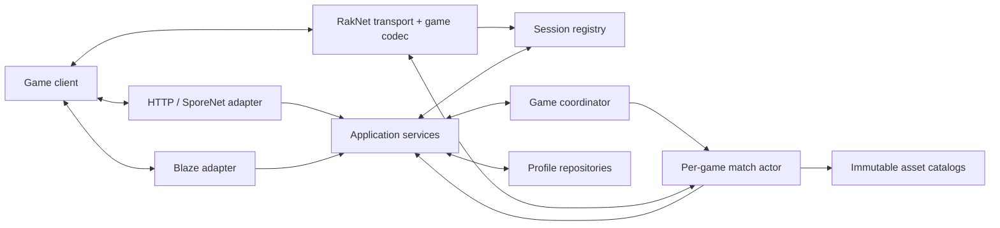

# Game server reconstruction architecture

## Status and intent

This is a proposed architecture for turning darkspin into an authoritative,
playable Game server. It is based on:

- the contracts verified against `Game.exe` 5.3.0.103 in
  [`../confirmed/game-5.3.0.103-first-pass.md`](../confirmed/game-5.3.0.103-first-pass.md);
- the behavior currently implemented in darkspin; and
- legacy hypotheses under `../unconfirmed/`.

Implementation conventions for these boundaries are defined in
[`go-domain-conventions.md`](go-domain-conventions.md).

Only facts directly backed by executable analysis should be described as
executable-confirmed.
The component boundaries and flows below are design decisions to test against
the client, not claims about the original Maxis server implementation.

The target is not merely a collection of endpoints that let the client reach a
menu. The target is a server-authoritative vertical slice:

1. authenticate and load an account;
2. edit creatures and squads and persist them;
3. create or join a game through Blaze;
4. connect the same identity to the gameplay UDP service;
5. load a level, move, use an ability, fight, receive loot, and finish;
6. commit the result once and show it on the next account request.

## What darkspin has today

| Area | Present implementation | Architectural gap |
| --- | --- | --- |
| HTTP/SporeNet | Bootstrap, account, inventory, creature, deck, room, status, leaderboard, telemetry, and utility handlers | Handlers parse transport input and mutate storage/domain objects directly; several confirmed request and response fields are missing |
| Blaze | Framing, TDF codecs, sessions, authentication, notifications, and a partially implemented GameManager component | A Blaze game is lobby metadata only; creating one does not allocate a gameplay runtime or a reachable gameplay endpoint |
| Game registry | `game.Manager` and `game.Instance` track IDs, metadata, state, and joined `sporenet.User` pointers | No authoritative match owner, command queue, world, endpoint, or lifecycle transaction |
| Gameplay model | Level, party/player, object manager, attributes, combat/update primitives, and Lua support exist | These pieces are not assembled per game and are not driven by authenticated network input |
| RakNet | Offline negotiation, bit streams, reliability datagram codecs, ACK/NACK codecs, and several Game application packet codecs | The server is not started by `server.Server`; connected RakNet datagrams, peer state, retransmission, ordering, fragmentation, and game/session binding are not wired |
| Persistence | Normalized SQLite user records, versioned schema migration, transactional aggregate replacement, and indexed active sessions | Match-result idempotency remains; transient presence/game state must stay outside durable profiles |
| Assets | Config, noun/template, level, and Lua asset loading | Version/build compatibility and immutable asset catalogs are not exposed as an explicit dependency of a match |
| Runtime | The composition root starts HTTP, Blaze, QoS, and one global Lua loop | Gameplay needs one isolated deterministic runtime per active match, not shared mutable match state in a process-global tick |

The most important missing link is therefore:

```text
authenticated HTTP account
        <-> Blaze connection/session
        <-> game allocation and membership
        <-> RakNet peer
        <-> one authoritative match runtime
        <-> committed account result
```

## Design rules

1. **Protocol adapters are not the domain.** HTTP XML, Blaze TDF, and RakNet
   bytes translate to the same application commands and events.
2. **One identity registry joins every protocol.** Do not infer a gameplay user
   from source address or independently maintained user maps.
3. **One goroutine owns each match's mutable state.** Network goroutines enqueue
   commands; only the match loop mutates the world.
4. **The server is authoritative.** Client movement and action packets express
   intent. The match validates them, updates state, and emits replication events.
5. **Persistence is outside the tick loop.** A match produces a result; an
   application service validates and commits it once at a lifecycle boundary.
6. **Compatibility is build-scoped.** The 5.3.0.103 and 5.3.0.127 contracts must
   not be blended into unlabelled hard-coded behavior.
7. **Every reverse-engineered claim is reproducible.** A finding should lead to
   an address/xref or trace, a note, and preferably a golden protocol fixture.

## Target component model



### Composition root

`server.Server` should remain the process composition root. It constructs and
owns listeners, repositories, services, the session registry, and the game
coordinator. It should not contain gameplay rules.

It must start and stop a gameplay UDP service alongside HTTP, Blaze, and QoS.
The advertised Blaze `HSES` endpoint and bootstrap ports must come from the same
validated configuration object as the actual listener. The current hard-coded
gameplay port must not be allowed to drift from the bound socket.

### Protocol adapters

#### HTTP / SporeNet

The HTTP adapter owns method names, query/form aliases, XML DTOs, and build
specific serialization. Its handler flow should be:

```text
request -> decode and validate DTO -> application command -> response DTO -> XML
```

Confirmed compatibility behavior belongs here, including accepting the
executable's `template_id` for `api.creature.unlockCreature` while optionally
retaining `noun_id` as a legacy alias. Account and part responses should be
serialized from a complete domain read model rather than assembled ad hoc in
individual handlers.

The listener bounds headers to 1 MiB, bodies to 1 MiB, complete request reads
and response writes to 30 seconds, and idle keep-alive connections to 60
seconds. These limits belong to the adapter and apply before a legacy handler
can retain a network resource indefinitely.

Replace the growing method switch incrementally with a registry of typed
handlers. Unknown fields should be logged at debug level with secrets redacted;
unknown methods should remain observable instead of silently succeeding.

#### Blaze

Blaze owns TCP/TLS framing, TDF request/response types, connection-local state,
and notifications. GameManager handlers should call application services rather
than mutate `game.Manager` directly.

The adapter translates application events such as `PlayerJoined`,
`GameStateChanged`, and `EndpointAllocated` into the exact Blaze notifications
the client expects. Unsupported commands should return explicit protocol errors
and produce a structured trace so the next missing client dependency is easy to
identify.

Blaze performs its TLS handshake explicitly within ten seconds, refreshes a
two-minute read deadline for every frame, and bounds serialized writes to
fifteen seconds. Handler panics are contained at dispatch, logged with a stack,
and returned as a correlated `ErrorSystem` reply without publishing partially
queued notifications.

#### RakNet and Game gameplay packets

Keep these layers separate even if they remain in one Go package initially:

```text
UDP socket
  -> RakNet offline handshake
  -> connected peer state
  -> ACK/NACK, retransmit, ordering, sequencing, split/reassembly
  -> Game application packet codec
  -> authenticated peer/session binding
  -> match command or replication event
```

The current server answers a later RakNet `0x05-0x08` offline handshake, then
treats application IDs as if they arrived directly in UDP datagrams. Build 103
instead uses the binary-confirmed single-stage `0x09/0x0a` exchange described
in [the RakNet/gameplay exchange note](raknet-gameplay-exchange.md). The
existing datagram and ACK/NACK codecs are foundations, but they still require
build-103 framing confirmation and a `Peer` state machine before gameplay can
be reliable.

`HelloPlayerRequest` should bind a connected peer to a short-lived game join
ticket issued after Blaze membership is accepted. The ticket should include at
least account ID, game ID, expiry, and an unpredictable nonce. A source IP or a
client-supplied account ID alone is not sufficient authentication.

### Application services

Application services express use cases shared by protocols. A practical first
set is:

- `AuthService`: authenticate credentials, issue/revoke tokens, and resolve a
  client build profile.
- `ProfileService`: return account, settings, creature, squad, feed, and unlock
  read models.
- `InventoryService`: list, unlock, vendor, and equip parts with ownership and
  currency validation.
- `CreatureService`: create/update creatures and squads with noun/unlock checks.
- `PresenceService`: rooms, status, and active connection state.
- `GameService`: create/join/leave/destroy games, allocate endpoints, issue join
  tickets, and drive the Blaze-visible lifecycle.
- `ResultService`: validate an idempotent match result and atomically commit XP,
  DNA, loot, unlocks, and feed entries.

Services depend on interfaces for repositories, sessions, games, clocks, and
assets. Protocol types must not appear in those interfaces.

### Session and identity registry

Use one registry for the cross-protocol identity chain:

```text
HTTP auth token
  -> AccountID
  -> Blaze connection/session ID
  -> GameID and membership
  -> join ticket
  -> RakNet peer ID/address
```

The registry stores transient state only. It should support multiple transport
connections deliberately, reject ticket replay, expire disconnected sessions,
and notify `GameService` when the last relevant connection disappears.

Move `RoomID`, `GameID`, connection state, and tokens out of the persisted user
aggregate over time. The persisted profile should contain durable account and
inventory data; presence and game membership belong in the registry.

### Game coordinator and match actor

`game.Manager` should evolve into a coordinator of game metadata and runtime
handles. Each accepted game allocation creates one match actor:

```go
type Runtime interface {
	Submit(Command) error
	Events() <-chan Event
	Stop(context.Context) (Result, error)
}
```

The concrete runtime owns:

- lifecycle state and membership;
- level and mode state;
- party/player state;
- object manager and authoritative object IDs;
- deterministic clock, tick number, and random source;
- per-match Lua state or another isolated ability scheduler;
- pending commands and outgoing replication events; and
- the final, immutable match result.

Network readers never mutate these values. They decode a packet, resolve the
peer, and enqueue a command. On a fixed tick, the actor drains commands in a
defined order, validates actions, advances scripts/physics/combat, and emits
events. A network publisher converts events to per-client packets.

Start with a conservative fixed tick supported by observed behavior; do not
treat the current 16 ms global Lua interval as executable-confirmed. Record the
tick and RNG seed so failures can be replayed deterministically.

### Persistence and transactions

Define repositories around domain needs, not the current XML representation:

```go
type ProfileRepository interface {
	Load(context.Context, AccountID) (*Profile, error)
	Update(context.Context, AccountID, ExpectedRevision, func(*Profile) error) error
}
```

The first seam is implemented as `sporenet.UserRepository`, with `Create`,
`LoadByUsername`, and `Save` operations over detached `UserRecord` values. The
default `sporenet/sqlite` adapter normalizes profiles and commits complete
aggregate updates in transactions. `sporenet.UserManager` owns indexed active/login
state and delegates durable I/O, so HTTP and Blaze do not change when PostgreSQL
is introduced.

A `MatchID`-keyed result ledger must make end-game reward commits idempotent.

A PostgreSQL adapter should be introduced after the service boundary is in
place. Start with one transaction per aggregate update and database-enforced
uniqueness for account ID and normalized email. Durable match results need a
unique match ID. Account/profile, creatures, squads, parts, and applied results
can then be normalized as their query patterns become known; authentication
tokens, Blaze connections, rooms, and active game membership remain transient.
Add password hashing and an XML-to-PostgreSQL importer as part of that migration
rather than copying the current plaintext password representation unchanged.

Immutable nouns, templates, levels, and scripts should be loaded into validated
catalogs at startup and injected into services/runtimes. A match retains the
catalog/version it started with so asset reloads cannot alter an active game.

## Authoritative lifecycle

### 1. Bootstrap, login, and account load

1. The HTTP adapter selects a build profile and advertises endpoints from live
   configuration.
2. `AuthService` validates the login and issues a token associated with the
   account and build.
3. `ProfileService` supplies the confirmed account sections and complete part
   fields requested by that build.
4. Blaze authentication attaches its connection to the same account in the
   session registry.

### 2. Lobby and game allocation

1. A Blaze create/join command reaches `GameService`.
2. `GameService` validates membership and asks the coordinator to create or
   locate a game.
3. The coordinator allocates a match actor and gameplay endpoint.
4. `GameService` records membership, issues a one-use join ticket, and returns
   the endpoint through the required Blaze response/notifications.
5. Blaze lifecycle state mirrors the authoritative coordinator state; it does
   not independently advance the match.

### 3. Gameplay connection

1. RakNet completes offline and connected negotiation.
2. The Game hello carries or resolves a join ticket; exact fields remain a
   reverse-engineering target.
3. The session registry consumes the ticket and binds the peer to account/game.
4. The match receives `PlayerConnected`; it emits initial game, player, object,
   and level state in the client-required order.
5. Blaze receives membership/state notifications derived from this transition.

### 4. Authoritative game loop

1. Movement, action, status, and game-state packets decode into typed commands.
2. The match validates sender, lifecycle, ownership, timing, resource costs, and
   target/range constraints.
3. It advances world state and produces object create/update/delete, movement,
   physics, action, loot, and lifecycle events.
4. The publisher sends reliable/ordered or sequenced packets according to the
   confirmed requirement for each packet family.
5. Periodic structured snapshots make desyncs and replays diagnosable.

### 5. Completion and result commit

1. The match alone decides terminal success/failure and freezes a `MatchResult`.
2. `ResultService` commits it under `MatchID` exactly once.
3. The coordinator advances to post-game and emits Blaze notifications.
4. The next account/inventory request observes the committed progression.
5. After peers leave or a timeout expires, the coordinator destroys the actor
   and revokes outstanding tickets.

## Build compatibility

Introduce an explicit `ClientProfile`, selected from evidence available during
bootstrap/authentication:

```go
type ClientProfile struct {
	Build             string
	HTTPAliases       map[string]string
	AccountFields     FieldSet
	PartFields        FieldSet
	BootstrapPorts    FieldSet
	RakNetCodec       GameplayCodec
}
```

Initially support exactly the executable in this repository, 5.3.0.103. Keep
5.3.0.127 legacy notes as hypotheses until verified against that binary. This
also removes current scattered version literals from game allocation and HTTP
responses.

## Implementation sequence

### Phase 0: evidence and observability

- Add a structured, correlation-ID trace spanning HTTP token, Blaze session,
  game ID, join ticket, RakNet peer, and match ID.
- Build redacted fixtures for confirmed HTTP requests/responses and golden tests
  for TDF, RakNet datagrams, and gameplay packets.
- Record packet direction, ID, length, reliability/order metadata, game, peer,
  and tick. Keep raw payload capture opt-in because it may contain credentials.
- Continue the evidence workflow: legacy hypothesis -> executable xref/bytes ->
  confirmed note -> fixture -> implementation -> live client observation.

### Phase 1: make the pre-game API contract-correct

- Accept `template_id` for creature unlock and retain `noun_id` only as an
  intentional compatibility alias.
- Serialize the confirmed account progression/unlock fields already represented
  by the domain model.
- Serialize all confirmed part fields and implement the observed part filters.
- Advertise every confirmed bootstrap port from validated runtime config.
- Add request/response contract tests for each mutation before changing its
  domain behavior.

### Phase 2: unify identity and application behavior

- Add the session registry and build profile.
- Extract `AuthService`, `ProfileService`, `InventoryService`, and
  `CreatureService`; route existing HTTP handlers through them.
- Route Blaze authentication and game membership through the same registry.
- Separate durable profile data from transient presence/game membership.

### Phase 3: connect game allocation to RakNet

- Add a configured gameplay UDP port and advertise that exact endpoint.
- Maintain the implemented connected RakNet peer state: ACK/NACK,
  retransmission, receive deduplication, ordering, sequencing, fragmentation,
  disconnect handling, and bounded idle expiry.
- Add one-use join tickets and peer/session/game binding.
- Make Blaze create/join allocate a runtime and make destroy/leave tear it down.
- Confirm the hello/connected/setup packet sequence with executable analysis and
  a live trace before declaring the phase complete.

### Phase 4: first playable authoritative slice

- Create a per-match actor with isolated world, Lua state, clock, and RNG.
- Load one known level and party.
- Implement initial object replication, player movement, one action/ability,
  damage/death, one loot drop, and terminal game state.
- Commit an idempotent result and verify it appears after reconnect.

### Phase 5: broaden gameplay and progression

- Fill out ability targeting, cooldowns, resources, buffs/debuffs, AI, collision,
  objectives, difficulty, loot tables, catalysts, and progression.
- Implement packet families only when a level or feature needs them; attach each
  to a trace or executable finding.
- Add deterministic replay tests for every fixed gameplay bug.

### Phase 6: multiplayer and operations

- Validate join/leave/reconnect, host loss, party merge, latency, packet loss,
  duplicate commands, and concurrent result commits.
- Add server limits, backpressure, metrics, administrative inspection, graceful
  match drain, persistence backup/migration, and credential hardening.

## First vertical-slice acceptance test

A milestone is playable only when an unmodified supported client can complete
this sequence twice:

```text
login -> load profile -> select squad -> create game -> connect gameplay UDP
-> load level -> move -> use ability -> kill target -> receive loot
-> finish -> return to menus -> reload account -> see persisted result
```

The second run verifies that reconnect, cleanup, and persistence are real rather
than state left alive from the first process session.

## High-priority unknowns to confirm next

As of 2026-07-16, these map directly to IDA-01 through IDA-06 in the
[reverse-engineering research roadmap](reverse-engineering-research-roadmap.md).
The current candidate reset-dedicated-server trace reaches GameManager command
`0x19` and notifications `0x0F`, `0x14`, and `0x15`, but the client immediately
sends remove-player `0x0B`. A separate tutorial-named trace rejects join `0x09`
with error `0x0002` before gameplay UDP. These are failure boundaries, not a
completed game-session contract. The current HelloPlayer decoder's
little-endian `uint64 UserID` and optional `uint64 PlaygroupID` layout is
reference-derived; it remains an IDA-03 candidate until the build-103 request
serializer or a two-profile gameplay trace confirms it.

1. The exact Blaze notification sequence and TDF fields between create/join,
   endpoint allocation, pre-game, and in-game state.
2. The remaining connected RakNet acceptance exchange after the confirmed
   single-stage `0x09/0x0a` opening and reliable internal `0x04` request.
3. The identity fields in `HelloPlayerRequest` and how the original client ties
   them to Blaze game membership.
4. Reliability, ordering channel, and frequency for every application packet
   family used in the first vertical slice.
5. The required initial replication order for level, party, players, and world
   objects.
6. Which movement, physics, cooldown, hit, loot, and completion values the
   client expects the server to author versus echo.
7. End-game/result messages required before the client safely returns to menus.

These should drive the next executable xrefs and live capture. They are more
valuable to playability than exhaustively naming unused endpoints or packet IDs.
